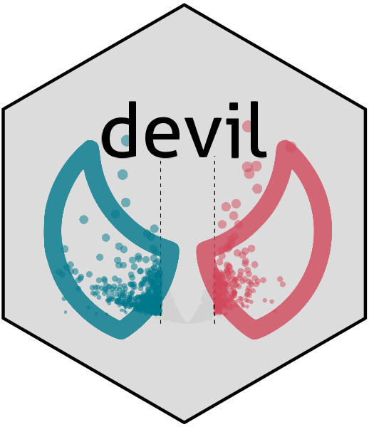

<!-- README.md is generated from README.Rmd. Please edit that file -->
<!-- Use devtools::build_readme() to update the files -->

```{r, include = FALSE}
knitr::opts_chunk$set(
  collapse = TRUE,
  comment = "#>",
  fig.path = "man/figures/README-",
  out.width = "100%"
)
```

# devil <a href="caravagnalab.github.io/rdevil"></a>

<!-- badges: start -->
<!-- badges: end -->

`devil` is an R package for differential expression analysis in single-cell RNA sequencing (scRNA-seq) data. It supports both single- and multi-patient experimental designs, implementing robust statistical methods to identify differentially expressed genes while accounting for technical and biological variability.

Key features are:

1.  Flexible experimental design support (single/multiple patients)
2.  Robust statistical testing framework
3.  Efficient implementation for large-scale datasets

## Installation

You can install the current version of `devil` from [GitHub](https://github.com/) with:

``` r
devtools::install_github("caravagnalab/devil")
```

The CUDA implementation is, as today, in the devel branch.

## Example

This is a basic example which shows you how to fit the expression for a single gene observed in 1000 cells.

```{r example}
library(devil)
y <- t(as.matrix(rnbinom(1000, 1, .1)))
fit <- devil::fit_devil(input_matrix=y, design_matrix=matrix(1, ncol = 1, nrow = 1000), verbose=T, size_factors=T, overdispersion = T)
test <- devil::test_de(fit, c(1))
```

-----
  
#### Copyright and contacts
  
Giulio Caravagna, Giovanni Santacatterina. Cancer Data Science (CDS) Laboratory.

[](https://github.com/caravagnalab/)
[](https://www.caravagnalab.org/)
