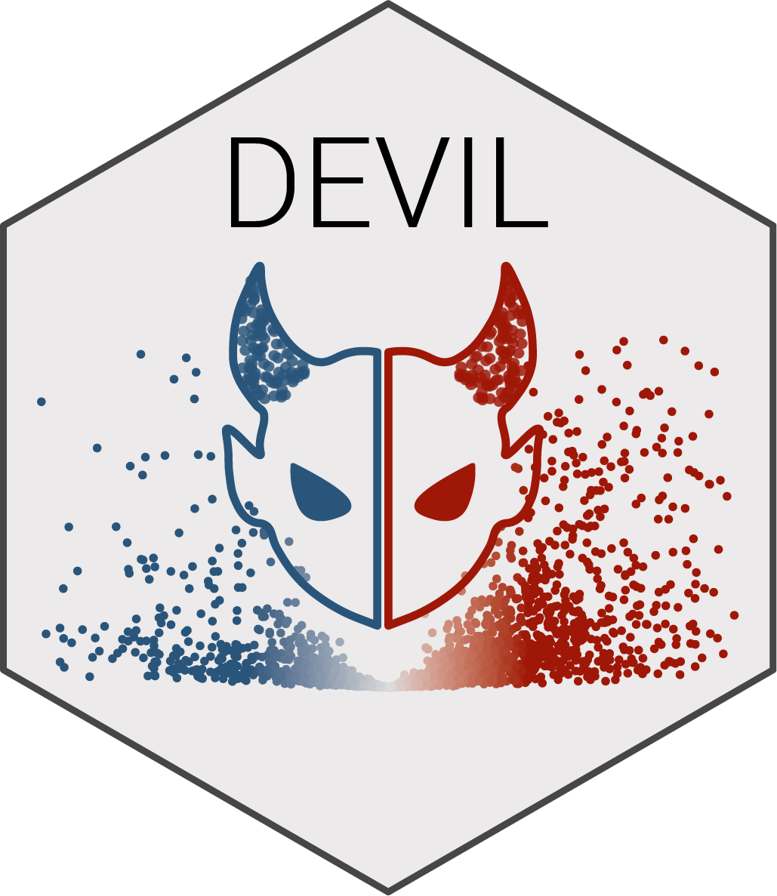

<!-- README.md is generated from README.Rmd. Please edit that file -->
<!-- Use devtools::build_readme() to update the files -->

```{r, include = FALSE}
knitr::opts_chunk$set(
    collapse = TRUE,
    comment = "#>",
    fig.path = "man/figures/README-",
    out.width = "100%"
)
```

# devil <a href="caravagnalab.github.io/rdevil"></a>

<!-- badges: start -->
[](https://github.com/caravagnalab/devil/actions/workflows/R-CMD-check.yaml)
[](https://github.com/caravagnalab/devil/actions/workflows/bioc-check.yaml)
[](https://github.com/caravagnalab/devil/actions/workflows/test-coverage.yaml)
[](https://github.com/caravagnalab/devil/actions/workflows/pkgdown.yaml)
<!-- badges: end -->

`devil` is an R package for differential expression analysis in single-cell RNA sequencing (scRNA-seq) data. It implements the statistical model described in [Santacatterina, Tosato et al](https://doi.org/10.1038/s41467-026-74451-9). It supports both single- and multi-patient experimental designs, implementing robust statistical methods to identify differentially expressed genes while accounting for technical and biological variability.

Key features are:

1.  Flexible experimental design support (single/multiple patients)
2.  Robust statistical testing framework
3.  Efficient implementation for large-scale datasets

#### Citation

If you use `devil`, please cite:

* G. Santacatterina, N. Tosato, S. Milite, K. Davydzenka, E. Insaghi, G. Sanguinetti, S. Cozzini, L. Egidi, G. Caravagna. *Scalable, fast and accurate differential gene expression testing from millions of cells of multiple patients.* Nat Commun (2026). 

[](https://doi.org/10.1038/s41467-026-74451-9)

## Installation

You can install the current version of `devil` from [GitHub](https://github.com/) with:

``` r
devtools::install_github("caravagnalab/devil")
```

We also provide two detailed vignettes for both CPU and GPU installation:

- [Quick CPU & GPU Setup](https://caravagnalab.github.io/devil/articles/quick_setup.html)
- [Detailed GPU Setup](https://caravagnalab.github.io/devil/articles/gpu_setup.html)

-----
  
#### Copyright and contacts
  
Giulio Caravagna, Giovanni Santacatterina. Cancer Data Science (CDS) Laboratory.

[](https://github.com/caravagnalab/)
[](https://www.caravagnalab.org/)
