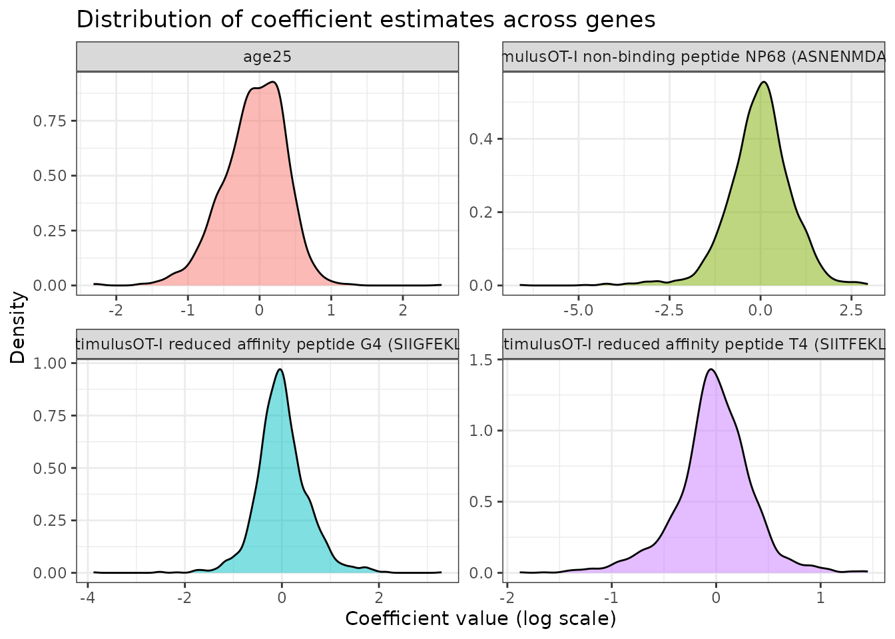
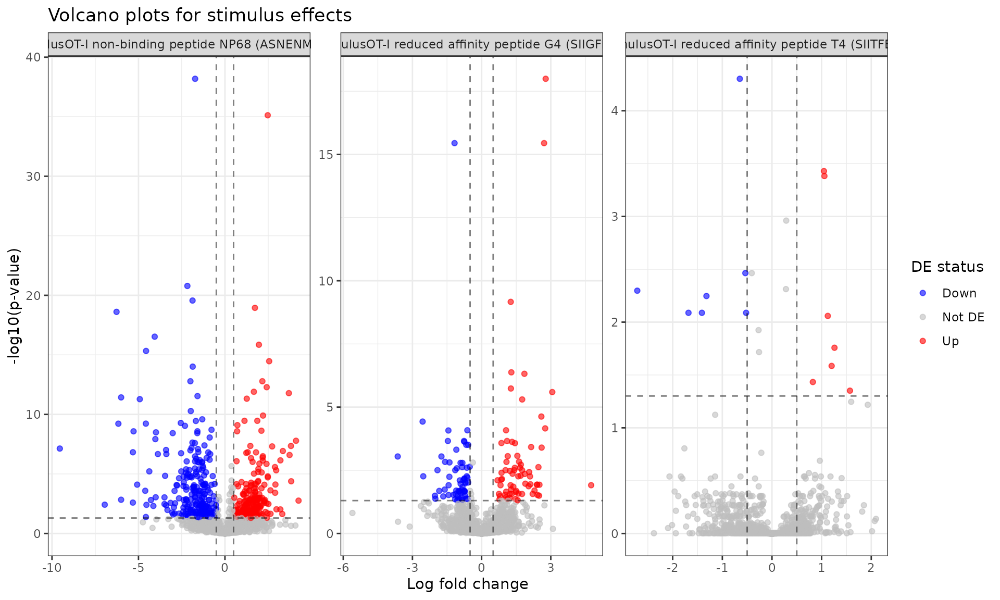

# Using devil for complex designs with multiple covariates

``` r
library(devil)
library(scRNAseq)
library(SingleCellExperiment)
library(Matrix)
library(dplyr)
library(ggplot2)
library(tidyr)
```

In this vignette we illustrate how to use **devil** with a **non-trivial
design matrix** including multiple covariates, using the
[`RichardTCellData()`](https://rdrr.io/pkg/scRNAseq/man/RichardTCellData.html)
dataset from the **scRNAseq** package. We’ll show how to:

1.  Fit a model with multiple covariates
2.  Extract and interpret coefficients
3.  Perform differential expression testing
4.  Visualize results

## Loading the dataset

``` r
sce <- scRNAseq::RichardTCellData()
#> downloading 1 resources
#> retrieving 1 resource
#> loading from cache
#> require("ensembldb")
sce
#> class: SingleCellExperiment 
#> dim: 46603 572 
#> metadata(0):
#> assays(1): counts
#> rownames(46603): ENSMUSG00000102693 ENSMUSG00000064842 ...
#>   ENSMUSG00000096730 ENSMUSG00000095742
#> rowData names(0):
#> colnames(572): SLX-12611.N701_S502. SLX-12611.N702_S502. ...
#>   SLX-12612.i712_i522. SLX-12612.i714_i522.
#> colData names(13): age individual ... stimulus time
#> reducedDimNames(0):
#> mainExpName: endogenous
#> altExpNames(1): ERCC
colnames(colData(sce))
#>  [1] "age"                        "individual"                
#>  [3] "single cell well quality"   "post-analysis well quality"
#>  [5] "single cell quality"        "CD69 measurement (log10)"  
#>  [7] "CD25 measurement (log10)"   "CD44 measurement (log10)"  
#>  [9] "CD62L measurement (log10)"  "sorting plate well"        
#> [11] "sequencing plate well"      "stimulus"                  
#> [13] "time"
head(as.data.frame(colData(sce))[, c("individual", "age", "stimulus", "time", "single.cell.quality")])
#>                      individual age                                    stimulus
#> SLX-12611.N701_S502.          1  25 OT-I reduced affinity peptide G4 (SIIGFEKL)
#> SLX-12611.N702_S502.          1  25 OT-I reduced affinity peptide G4 (SIIGFEKL)
#> SLX-12611.N703_S502.          1  25 OT-I reduced affinity peptide G4 (SIIGFEKL)
#> SLX-12611.N704_S502.          1  25 OT-I reduced affinity peptide G4 (SIIGFEKL)
#> SLX-12611.N705_S502.          1  25 OT-I reduced affinity peptide G4 (SIIGFEKL)
#> SLX-12611.N706_S502.          1  25 OT-I reduced affinity peptide G4 (SIIGFEKL)
#>                      time single.cell.quality
#> SLX-12611.N701_S502.    6                  OK
#> SLX-12611.N702_S502.    6                  OK
#> SLX-12611.N703_S502.    6                  OK
#> SLX-12611.N704_S502.    6                  OK
#> SLX-12611.N705_S502.    6                  OK
#> SLX-12611.N706_S502.    6                  OK
```

## Basic filtering

We keep only cells flagged as high quality and do light gene filtering
for speed.

``` r
# Keep only good-quality cells
sce <- sce[, sce$`single cell quality` == "OK"]

# Make sure key covariates are factors
sce$individual <- factor(sce$individual)
sce$age <- factor(sce$age) # e.g. "young"/"old"
sce$stimulus <- droplevels(factor(sce$stimulus))
sce$time <- as.numeric(sce$time)
sce$time_factor <- factor(sce$time, levels = sort(unique(sce$time)))

# Quick summary
table(sce$stimulus, sce$time_factor)
#>                                              
#>                                                1  3  6
#>   OT-I high affinity peptide N4 (SIINFEKL)    51 64 91
#>   OT-I non-binding peptide NP68 (ASNENMDAM)    0  0 93
#>   OT-I reduced affinity peptide G4 (SIIGFEKL)  0  0 94
#>   OT-I reduced affinity peptide T4 (SIITFEKL)  0  0 91
#>   unstimulated                                 0  0  0
table(sce$age)
#> 
#> 11.5   25 
#>  344  184
length(unique(sce$individual))
#> [1] 2
```

Filter genes with very low counts (optional):

``` r
counts <- assay(sce, "counts")
keep_genes <- Matrix::rowMeans(counts) > .1 & rowSums(counts > 0) > 100
sce <- sce[keep_genes, ]
sce <- sce[, sce$stimulus != "unstimulated"]
dim(sce)
#> [1] 7267  484
```

For this vignette, we subsample further so that `devil` runs very
quickly:

``` r
set.seed(123)
n_genes <- min(2000, nrow(sce))
n_cells <- min(3000, ncol(sce))
gene_idx <- sample(seq_len(nrow(sce)), n_genes)
cell_idx <- sample(seq_len(ncol(sce)), n_cells)
sce_sub <- sce[gene_idx, cell_idx]
sce_sub
#> class: SingleCellExperiment 
#> dim: 2000 484 
#> metadata(0):
#> assays(1): counts
#> rownames(2000): ENSMUSG00000038342 ENSMUSG00000060261 ...
#>   ENSMUSG00000021076 ENSMUSG00000026005
#> rowData names(0):
#> colnames(484): SLX-12611.N718_S515. SLX-12611.N721_S517. ...
#>   SLX-12612.i723_i507. SLX-12612.i716_i513.
#> colData names(14): age individual ... time time_factor
#> reducedDimNames(0):
#> mainExpName: endogenous
#> altExpNames(1): ERCC
```

From now on we’ll work with `sce_sub`.

## Building a complex design matrix

We consider a model with:

- **Main effects**: `stimulus` (different T cell stimulation
  conditions), `age`
- **Reference levels**: The first level of each factor will be the
  baseline

``` r
meta_df <- as.data.frame(colData(sce_sub))
meta_df$stimulus <- droplevels(factor(meta_df$stimulus))
meta_df$time_factor <- factor(meta_df$time_factor)
meta_df$age <- meta_df$age
meta_df$individual <- factor(meta_df$individual)

design <- model.matrix(
    ~ stimulus + age,
    data = meta_df
)
head(design)
#>                      (Intercept)
#> SLX-12611.N718_S515.           1
#> SLX-12611.N721_S517.           1
#> SLX-12611.N716_S516.           1
#> SLX-12612.i718_i503.           1
#> SLX-12612.i720_i513.           1
#> SLX-12612.i714_i505.           1
#>                      stimulusOT-I non-binding peptide NP68 (ASNENMDAM)
#> SLX-12611.N718_S515.                                                 0
#> SLX-12611.N721_S517.                                                 0
#> SLX-12611.N716_S516.                                                 0
#> SLX-12612.i718_i503.                                                 0
#> SLX-12612.i720_i513.                                                 0
#> SLX-12612.i714_i505.                                                 0
#>                      stimulusOT-I reduced affinity peptide G4 (SIIGFEKL)
#> SLX-12611.N718_S515.                                                   0
#> SLX-12611.N721_S517.                                                   1
#> SLX-12611.N716_S516.                                                   1
#> SLX-12612.i718_i503.                                                   0
#> SLX-12612.i720_i513.                                                   1
#> SLX-12612.i714_i505.                                                   1
#>                      stimulusOT-I reduced affinity peptide T4 (SIITFEKL) age25
#> SLX-12611.N718_S515.                                                   1     1
#> SLX-12611.N721_S517.                                                   0     1
#> SLX-12611.N716_S516.                                                   0     1
#> SLX-12612.i718_i503.                                                   0     0
#> SLX-12612.i720_i513.                                                   0     0
#> SLX-12612.i714_i505.                                                   0     0
colnames(design)
#> [1] "(Intercept)"                                        
#> [2] "stimulusOT-I non-binding peptide NP68 (ASNENMDAM)"  
#> [3] "stimulusOT-I reduced affinity peptide G4 (SIIGFEKL)"
#> [4] "stimulusOT-I reduced affinity peptide T4 (SIITFEKL)"
#> [5] "age25"
```

The design matrix includes:

- `(Intercept)`: Baseline expression level
- `stimulus*`: Effects of different stimulation conditions relative to
  the reference
- `age*`: Effect of age group

## Fitting the devil model

Now,
[`fit_devil()`](https://caravagnalab.github.io/devil/reference/fit_devil.md)
takes a count matrix and a design matrix and returns coefficients and
overdispersions.

``` r
Y <- as.matrix(assay(sce_sub, "counts"))
devil_fit <- devil::fit_devil(
    input_matrix = Y,
    design_matrix = design,
    verbose = TRUE,
    init_beta_rough = FALSE,
    size_factors = "normed_sum", 
    overdispersion = "MOM"
)
#> Compute size factors
#> Calculating size factors using method: normed_sum
#> Size factors calculated successfully.
#> Range: [0.1449, 18.1165]
#> Initialize theta
#> Initialize beta
#> Fitting beta coefficients
#> Fit overdispersion (mode = MOM)
```

## Interpreting the model coefficients

The fitted model contains coefficient estimates (log-scale) for each
gene and each term in the design matrix.

``` r
# Extract coefficient matrix (genes x coefficients)
beta_matrix <- devil_fit$beta
dim(beta_matrix)
#> [1] 2000    5
colnames(beta_matrix) = colnames(design)

# Look at coefficient distributions for a few terms
coef_df <- as.data.frame(beta_matrix) %>%
    mutate(gene = rownames(beta_matrix))

# Visualize coefficient distributions
coef_long <- coef_df %>%
    pivot_longer(cols = -gene, names_to = "coefficient", values_to = "value")

ggplot(coef_long %>% dplyr::filter(coefficient != "(Intercept)"), 
       aes(x = value, fill = coefficient)) +
    geom_density(alpha = 0.5) +
    facet_wrap(~coefficient, scales = "free") +
    theme_bw() +
    labs(title = "Distribution of coefficient estimates across genes",
         x = "Coefficient value (log scale)",
         y = "Density") +
    theme(legend.position = "none")
```



**Interpretation**:

- Coefficients represent log-fold changes relative to the baseline
  (intercept)
- Large positive coefficients indicate upregulation
- Large negative coefficients indicate downregulation
- Coefficients near zero suggest little effect

``` r
# Extract overdispersion parameters
theta_vec <- devil_fit$overdispersion
names(theta_vec) = rownames(Y)
summary(theta_vec)
#>     Min.  1st Qu.   Median     Mean  3rd Qu.     Max. 
#>  0.04054  1.31511  2.45837  3.66026  4.48420 75.12339

# Visualize overdispersion distribution
data.frame(theta = theta_vec, gene = names(theta_vec)) %>%
    ggplot(aes(x = theta)) +
    geom_histogram(bins = 50, fill = "steelblue", alpha = 0.7) +
    theme_bw() +
    labs(title = "Distribution of gene-wise overdispersion parameters",
         x = "Theta (dispersion parameter)",
         y = "Number of genes") +
    geom_vline(xintercept = median(theta_vec), linetype = "dashed", color = "red")
```


**Interpretation**: Higher theta values indicate less overdispersion
(more Poisson-like), while lower values indicate more overdispersion
(more variability than expected).

## Differential expression testing

Now let’s test for differential expression. We’ll test specific
hypotheses using Wald tests.

### Testing stimulus effects

Let’s identify genes differentially expressed in response to different
stimuli:

``` r
# For demonstration, we'll create a simplified test
stimulus_coefs <- grep("^stimulus", colnames(beta_matrix), value = TRUE)

# Test each stimulus coefficient
de_results_list <- lapply(stimulus_coefs, function(coef) {
    contrast_vector = as.numeric(colnames(beta_matrix) == coef)
  
    # Simple approach: test if coefficient significantly different from 0
    de_res = devil::test_de(devil_fit, contrast = contrast_vector, clusters = meta_df$individual, max_lfc = 100)
    de_res %>% dplyr::mutate(coefficient = coef)
})
#> Converting clusters to numeric factors
#> Converting clusters to numeric factors
#> Converting clusters to numeric factors

de_results <- bind_rows(de_results_list)

# Summary of DE genes per stimulus
de_summary <- de_results %>%
    group_by(coefficient) %>%
    summarise(
        n_de = sum(adj_pval < 0.05),
        n_up = sum(adj_pval < 0.05 & lfc > 0),
        n_down = sum(adj_pval < 0.05 & lfc < 0),
        .groups = "drop"
    )

print(de_summary)
#> # A tibble: 3 × 4
#>   coefficient                                          n_de  n_up n_down
#>   <chr>                                               <int> <int>  <int>
#> 1 stimulusOT-I non-binding peptide NP68 (ASNENMDAM)     533   261    272
#> 2 stimulusOT-I reduced affinity peptide G4 (SIIGFEKL)   139    70     69
#> 3 stimulusOT-I reduced affinity peptide T4 (SIITFEKL)    19     9     10
```

### Volcano plots

Visualize the differential expression results:

``` r
# Create volcano plot for each stimulus
de_results %>%
    mutate(
        de_status = case_when(
            adj_pval < 0.05 & lfc > 0.5 ~ "Up",
            adj_pval < 0.05 & lfc < -0.5 ~ "Down",
            TRUE ~ "Not DE"
        )
    ) %>%
    ggplot(aes(x = lfc, y = -log10(adj_pval), color = de_status)) +
    geom_point(alpha = 0.6, size = 1.5) +
    facet_wrap(~coefficient, scales = "free") +
    scale_color_manual(values = c("Up" = "red", "Down" = "blue", "Not DE" = "gray")) +
    theme_bw() +
    labs(title = "Volcano plots for stimulus effects",
         x = "Log fold change",
         y = "-log10(p-value)",
         color = "DE status") +
    geom_hline(yintercept = -log10(0.05), linetype = "dashed", alpha = 0.5) +
    geom_vline(xintercept = c(-0.5, 0.5), linetype = "dashed", alpha = 0.5)
```



### Top differentially expressed genes

``` r
# Extract top DE genes for each stimulus
top_genes <- de_results %>%
    dplyr::filter(adj_pval < 0.05) %>%
    dplyr::group_by(coefficient) %>%
    dplyr::arrange(adj_pval) %>%
    dplyr::slice_head(n = 10) %>%
    dplyr::select(coefficient, name, lfc, adj_pval)

print(top_genes)
#> # A tibble: 30 × 4
#> # Groups:   coefficient [3]
#>    coefficient                                       name           lfc adj_pval
#>    <chr>                                             <chr>        <dbl>    <dbl>
#>  1 stimulusOT-I non-binding peptide NP68 (ASNENMDAM) ENSMUSG0000… -1.72 6.55e-39
#>  2 stimulusOT-I non-binding peptide NP68 (ASNENMDAM) ENSMUSG0000…  2.47 7.58e-36
#>  3 stimulusOT-I non-binding peptide NP68 (ASNENMDAM) ENSMUSG0000… -2.17 1.63e-21
#>  4 stimulusOT-I non-binding peptide NP68 (ASNENMDAM) ENSMUSG0000… -1.87 2.74e-20
#>  5 stimulusOT-I non-binding peptide NP68 (ASNENMDAM) ENSMUSG0000…  1.73 1.12e-19
#>  6 stimulusOT-I non-binding peptide NP68 (ASNENMDAM) ENSMUSG0000… -6.27 2.45e-19
#>  7 stimulusOT-I non-binding peptide NP68 (ASNENMDAM) ENSMUSG0000… -4.06 2.97e-17
#>  8 stimulusOT-I non-binding peptide NP68 (ASNENMDAM) ENSMUSG0000…  1.96 1.41e-16
#>  9 stimulusOT-I non-binding peptide NP68 (ASNENMDAM) ENSMUSG0000… -4.56 4.68e-16
#> 10 stimulusOT-I non-binding peptide NP68 (ASNENMDAM) ENSMUSG0000…  2.56 3.41e-15
#> # ℹ 20 more rows
```

### Heatmap of top DE genes

``` r
# Get top 20 most variable DE genes
top_de_genes <- de_results %>%
    dplyr::filter(adj_pval < 0.05) %>%
    dplyr::group_by(name) %>%
    dplyr::summarise(max_abs_lfc = max(abs(lfc)), .groups = "drop") %>%
    dplyr::arrange(desc(max_abs_lfc)) %>%
    dplyr::slice_head(n = 20) %>%
    dplyr::pull(name)

if (length(top_de_genes) > 0) {
    # Extract coefficients for top genes
    top_coef_matrix <- beta_matrix[top_de_genes, stimulus_coefs, drop = FALSE]
    
    # Create heatmap
    pheatmap::pheatmap(
        top_coef_matrix,
        scale = "row",
        cluster_cols = FALSE,
        main = "Top DE genes across stimuli",
        fontsize = 8
    )
}
```


## Testing age effects

``` r
# Test for age effect if present in model
age_coefs <- grep("^age", colnames(beta_matrix), value = TRUE)

if (length(age_coefs) > 0) {
    contrast_vector = as.numeric(colnames(beta_matrix) == age_coefs)
    age_de <- devil::test_de(devil_fit, contrast = contrast_vector, clusters = meta_df$individual)
    
    print(paste("Number of age-associated DE genes (FDR < 0.05):", sum(age_de$adj_pval < 0.05)))
    
    # Show top age-associated genes
    print(head(age_de))
}
#> Converting clusters to numeric factors
#> [1] "Number of age-associated DE genes (FDR < 0.05): 466"
#> # A tibble: 6 × 4
#>   name                  pval adj_pval    lfc
#>   <chr>                <dbl>    <dbl>  <dbl>
#> 1 ENSMUSG00000038342 0.146     0.313   0.320
#> 2 ENSMUSG00000060261 0.126     0.284  -0.298
#> 3 ENSMUSG00000029198 0.00268   0.0159  0.608
#> 4 ENSMUSG00000082951 0.00730   0.0356  0.493
#> 5 ENSMUSG00000022204 0.0935    0.232  -0.316
#> 6 ENSMUSG00000063802 0.0423    0.130   0.403
```

## Mean-variance relationship

Let’s also plot the mean-variance relationship, to see how far is the
model from a simple Poisson

``` r
# Mean-variance relationship
gene_means <- rowMeans(Y)
gene_vars <- apply(Y, 1, var)

plot_df <- data.frame(
    mean = gene_means,
    variance = gene_vars,
    theta = theta_vec
)

ggplot(plot_df, aes(x = log10(mean + 1), y = log10(variance + 1))) +
    geom_point(aes(color = log10(theta)), alpha = 0.5) +
    geom_abline(slope = 1, intercept = 0, linetype = "dashed", color = "red") +
    scale_color_viridis_c() +
    theme_bw() +
    labs(title = "Mean-variance relationship",
         x = "log10(mean count + 1)",
         y = "log10(variance + 1)",
         color = "log10(theta)") +
    annotate("text", x = Inf, y = -Inf, 
             label = "Dashed line = Poisson expectation",
             hjust = 1.1, vjust = -0.5, size = 3, color = "red")
```


## Summary

In this vignette we demonstrated:

1.  **Model fitting** with complex designs including multiple factors
2.  **Coefficient interpretation** showing how to extract and visualize
    effect sizes
3.  **Differential expression testing** using Wald tests on model
    coefficients
4.  **Result visualization** through volcano plots and heatmaps
5.  **Model diagnostics** to assess fit quality

The devil package provides a flexible framework for modeling single-cell
count data with complex experimental designs, enabling rigorous
differential expression analysis while accounting for overdispersion.

## Session Info

``` r
sessionInfo()
#> R version 4.5.2 (2025-10-31)
#> Platform: x86_64-pc-linux-gnu
#> Running under: Ubuntu 24.04.3 LTS
#> 
#> Matrix products: default
#> BLAS:   /usr/lib/x86_64-linux-gnu/openblas-pthread/libblas.so.3 
#> LAPACK: /usr/lib/x86_64-linux-gnu/openblas-pthread/libopenblasp-r0.3.26.so;  LAPACK version 3.12.0
#> 
#> locale:
#>  [1] LC_CTYPE=C.UTF-8       LC_NUMERIC=C           LC_TIME=C.UTF-8       
#>  [4] LC_COLLATE=C.UTF-8     LC_MONETARY=C.UTF-8    LC_MESSAGES=C.UTF-8   
#>  [7] LC_PAPER=C.UTF-8       LC_NAME=C              LC_ADDRESS=C          
#> [10] LC_TELEPHONE=C         LC_MEASUREMENT=C.UTF-8 LC_IDENTIFICATION=C   
#> 
#> time zone: UTC
#> tzcode source: system (glibc)
#> 
#> attached base packages:
#> [1] stats4    stats     graphics  grDevices utils     datasets  methods  
#> [8] base     
#> 
#> other attached packages:
#>  [1] ensembldb_2.34.0            AnnotationFilter_1.34.0    
#>  [3] GenomicFeatures_1.62.0      AnnotationDbi_1.72.0       
#>  [5] tidyr_1.3.2                 ggplot2_4.0.1              
#>  [7] dplyr_1.1.4                 Matrix_1.7-4               
#>  [9] scRNAseq_2.24.0             SingleCellExperiment_1.32.0
#> [11] SummarizedExperiment_1.40.0 Biobase_2.70.0             
#> [13] GenomicRanges_1.62.1        Seqinfo_1.0.0              
#> [15] IRanges_2.44.0              S4Vectors_0.48.0           
#> [17] BiocGenerics_0.56.0         generics_0.1.4             
#> [19] MatrixGenerics_1.22.0       matrixStats_1.5.0          
#> [21] devil_0.99.0               
#> 
#> loaded via a namespace (and not attached):
#>   [1] DBI_1.2.3                 bitops_1.0-9             
#>   [3] httr2_1.2.2               rlang_1.1.6              
#>   [5] magrittr_2.0.4            gypsum_1.6.0             
#>   [7] compiler_4.5.2            RSQLite_2.4.5            
#>   [9] DelayedMatrixStats_1.32.0 png_0.1-8                
#>  [11] systemfonts_1.3.1         vctrs_0.6.5              
#>  [13] ProtGenerics_1.42.0       pkgconfig_2.0.3          
#>  [15] crayon_1.5.3              fastmap_1.2.0            
#>  [17] dbplyr_2.5.1              XVector_0.50.0           
#>  [19] labeling_0.4.3            utf8_1.2.6               
#>  [21] Rsamtools_2.26.0          rmarkdown_2.30           
#>  [23] UCSC.utils_1.6.1          ragg_1.5.0               
#>  [25] purrr_1.2.0               bit_4.6.0                
#>  [27] xfun_0.55                 cachem_1.1.0             
#>  [29] cigarillo_1.0.0           GenomeInfoDb_1.46.2      
#>  [31] jsonlite_2.0.0            blob_1.2.4               
#>  [33] rhdf5filters_1.22.0       DelayedArray_0.36.0      
#>  [35] Rhdf5lib_1.32.0           BiocParallel_1.44.0      
#>  [37] parallel_4.5.2            R6_2.6.1                 
#>  [39] RColorBrewer_1.1-3        bslib_0.9.0              
#>  [41] rtracklayer_1.70.1        jquerylib_0.1.4          
#>  [43] Rcpp_1.1.0                knitr_1.51               
#>  [45] tidyselect_1.2.1          abind_1.4-8              
#>  [47] yaml_2.3.12               codetools_0.2-20         
#>  [49] curl_7.0.0                lattice_0.22-7           
#>  [51] alabaster.sce_1.10.0      tibble_3.3.0             
#>  [53] withr_3.0.2               S7_0.2.1                 
#>  [55] KEGGREST_1.50.0           evaluate_1.0.5           
#>  [57] desc_1.4.3                BiocFileCache_3.0.0      
#>  [59] alabaster.schemas_1.10.0  ExperimentHub_3.0.0      
#>  [61] Biostrings_2.78.0         pillar_1.11.1            
#>  [63] BiocManager_1.30.27       filelock_1.0.3           
#>  [65] RCurl_1.98-1.17           BiocVersion_3.22.0       
#>  [67] sparseMatrixStats_1.22.0  scales_1.4.0             
#>  [69] alabaster.base_1.10.0     glue_1.8.0               
#>  [71] alabaster.ranges_1.10.0   pheatmap_1.0.13          
#>  [73] alabaster.matrix_1.10.0   lazyeval_0.2.2           
#>  [75] tools_4.5.2               AnnotationHub_4.0.0      
#>  [77] BiocIO_1.20.0             GenomicAlignments_1.46.0 
#>  [79] fs_1.6.6                  XML_3.99-0.20            
#>  [81] rhdf5_2.54.1              grid_4.5.2               
#>  [83] HDF5Array_1.38.0          restfulr_0.0.16          
#>  [85] cli_3.6.5                 rappdirs_0.3.3           
#>  [87] textshaping_1.0.4         viridisLite_0.4.2        
#>  [89] S4Arrays_1.10.1           gtable_0.3.6             
#>  [91] alabaster.se_1.10.0       sass_0.4.10              
#>  [93] digest_0.6.39             SparseArray_1.10.8       
#>  [95] farver_2.1.2              rjson_0.2.23             
#>  [97] memoise_2.0.1             htmltools_0.5.9          
#>  [99] pkgdown_2.2.0             lifecycle_1.0.4          
#> [101] h5mread_1.2.1             httr_1.4.7               
#> [103] bit64_4.6.0-1
```
