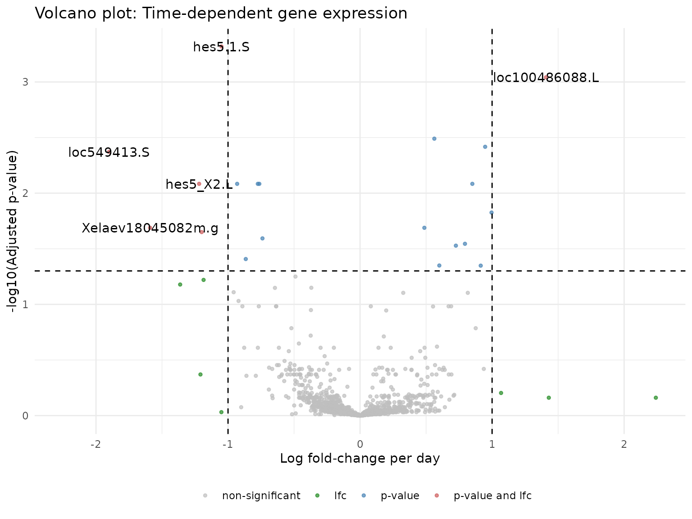
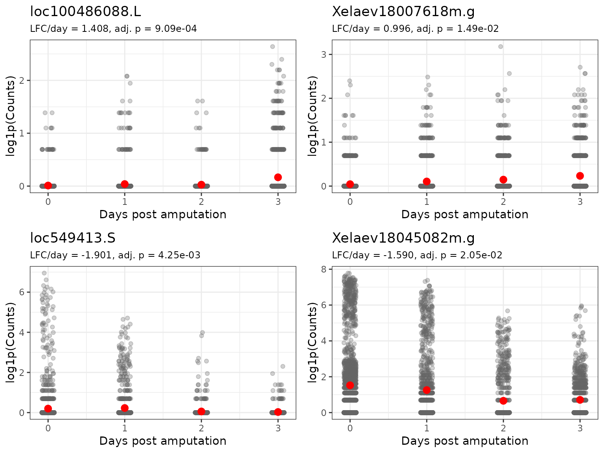

# Using devil for continuous variables

## Introduction

This vignette demonstrates how to use the `devil` package to perform
differential expression (DE) analysis with **continuous covariates**.
Specifically, we’ll analyze how gene expression changes over time in an
experiment where the continuous variable is days post-amputation.

## Setup and Data Loading

``` r
library(devil)
library(scRNAseq)
library(SingleCellExperiment)
library(Matrix)
library(dplyr)
library(ggplot2)
library(tidyr)
library(ggpubr)

# Load axolotl tail regeneration data
# This dataset contains scRNA-seq from regenerating tail tissue at different timepoints
sce <- scRNAseq::AztekinTailData()
```

## Data Preprocessing

### Quality Filtering

We first filter out genes with very low expression to remove noise and
improve computational efficiency:

``` r
counts <- assay(sce, "counts")

# Keep genes with:
# 1. Mean expression > 0.1 counts per cell
# 2. Detected in at least 100 cells
keep_genes <- rowMeans(counts) > 0.1 & rowSums(counts > 0) > 100
sce <- sce[keep_genes, ]

cat("After filtering:", nrow(sce), "genes and", ncol(sce), "cells\n")
#> After filtering: 7779 genes and 13199 cells
```

### Subsampling for Quick Demonstration

For this vignette, we subsample the data so computations run quickly. In
practice, you would use the full filtered dataset:

``` r
set.seed(123)
n_genes <- min(2000, nrow(sce))
n_cells <- min(5000, ncol(sce))

gene_idx <- sample(seq_len(nrow(sce)), n_genes)
cell_idx <- sample(seq_len(ncol(sce)), n_cells)
sce_sub <- sce[gene_idx, cell_idx]

cat("Working with:", nrow(sce_sub), "genes and", ncol(sce_sub), "cells\n")
#> Working with: 2000 genes and 5000 cells
```

## Building the Design Matrix

### Understanding the Covariate

Our main variable of interest is `DaysPostAmputation`, a continuous
variable representing time since amputation. Let’s examine its
distribution:

``` r
meta_df <- as.data.frame(colData(sce_sub))

# Check the range and distribution of DaysPostAmputation
cat("DaysPostAmputation range:", 
    min(meta_df$DaysPostAmputation), "to", 
    max(meta_df$DaysPostAmputation), "days\n")
#> DaysPostAmputation range: 0 to 3 days

table(meta_df$DaysPostAmputation)
#> 
#>    0    1    2    3 
#> 2004 1175  875  946
```

### Creating the Design Matrix

For a continuous covariate, the design matrix includes: 1. An
**intercept** term representing baseline expression 2. A **slope** term
for `DaysPostAmputation` representing the rate of change per day

``` r
design <- model.matrix(
  ~ DaysPostAmputation,
  data = meta_df
)

head(design, n = 10)
#>                    (Intercept) DaysPostAmputation
#> GCATACACAGCCAATT.1           1                  2
#> ATAGACCAGTGCGATG.1           1                  0
#> ATTACTCGTCTTCTCG.1           1                  1
#> GGACAAGAGAGGGCTT.1           1                  2
#> GATGCTACAGAGTGTG.1           1                  0
#> CTCTAATTCAAACAAG.1           1                  0
#> ACGTCAACAACACCTA.1           1                  3
#> TGTGGTATCTCTAGGA.1           1                  0
#> TCAGCTCCACAGGCCT.1           1                  0
#> GTCCTCAAGCGATGAC.1           1                  3
cat("\nDesign matrix columns:", colnames(design), "\n")
#> 
#> Design matrix columns: (Intercept) DaysPostAmputation
cat("Design matrix dimensions:", nrow(design), "cells ×", ncol(design), "coefficients\n")
#> Design matrix dimensions: 5000 cells × 2 coefficients
```

**Interpretation**: - `(Intercept)`: Expected log-expression at day 0 -
`DaysPostAmputation`: Change in log-expression per additional day (i.e.,
the slope)

## Fitting the devil model

Now,
[`fit_devil()`](https://caravagnalab.github.io/devil/reference/fit_devil.md)
takes a count matrix and a design matrix and returns coefficients and
overdispersions.

``` r
Y <- as.matrix(assay(sce_sub, "counts"))

devil_fit <- devil::fit_devil(
  input_matrix = Y,
  design_matrix = design,
  verbose = TRUE,
  init_beta_rough = FALSE,
  size_factors = "normed_sum", 
  overdispersion = "MOM"
)
#> Compute size factors
#> Calculating size factors using method: normed_sum
#> Size factors calculated successfully.
#> Range: [0.1246, 9.1512]
#> Initialize theta
#> Initialize beta
#> Fitting beta coefficients
#> Fit overdispersion (mode = MOM)
```

## Interpreting Model Coefficients

### Coefficient Matrix Structure

The fitted model contains coefficient estimates (on the log scale) for
each gene and each term in the design matrix:

``` r
beta_matrix <- devil_fit$beta
dim(beta_matrix)
#> [1] 2000    2
colnames(beta_matrix) <- colnames(design)

cat("\nCoefficient matrix: ", nrow(beta_matrix), "genes ×", 
    ncol(beta_matrix), "coefficients\n")
#> 
#> Coefficient matrix:  2000 genes × 2 coefficients
```

### Visualizing Coefficient Distributions

Let’s examine the distribution of the `DaysPostAmputation` coefficient
across all genes:

``` r
coef_df <- as.data.frame(beta_matrix) %>%
  dplyr::mutate(gene = rownames(beta_matrix))

# Reshape for plotting
coef_long <- coef_df %>%
  tidyr::pivot_longer(cols = -gene, names_to = "coefficient", values_to = "value")

# Plot distribution of DaysPostAmputation coefficient
ggplot(coef_long %>% dplyr::filter(coefficient == "DaysPostAmputation"), aes(x = value)) +
  geom_histogram(bins = 50, fill = "steelblue", alpha = 0.7) +
  geom_vline(xintercept = 0, linetype = "dashed", color = "red", linewidth = 1) +
  theme_bw() +
  labs(
    title = "Distribution of DaysPostAmputation coefficients across genes",
    subtitle = "Positive values = upregulated over time, Negative = downregulated",
    x = "Coefficient value (log fold-change per day)",
    y = "Number of genes"
  )
```


**Interpretation**:

- Genes with positive coefficients increase expression over time
- Genes with negative coefficients decrease expression over time
- The magnitude indicates the rate of change per day

## Differential Expression Testing

### Testing for Time-Dependent Expression

We use a Wald test to identify genes whose expression significantly
changes with days post-amputation. The contrast vector `c(0, 1)` tests
the `DaysPostAmputation` coefficient (second column in design matrix):

``` r
# Contrast vector: test the DaysPostAmputation coefficient
# c(Intercept, DaysPostAmputation)
contrast_vector <- c(0, 1)

de_res <- devil::test_de(
  devil_fit, 
  contrast = contrast_vector, 
  clusters = meta_df$sample,  # Account for sample-level correlation
  max_lfc = 100
)
#> Converting clusters to numeric factors

# Add gene names
de_res$name <- rownames(beta_matrix)

head(de_res)
#> # A tibble: 6 × 4
#>   name       pval adj_pval      lfc
#>   <chr>     <dbl>    <dbl>    <dbl>
#> 1 timm10b.S 0.633    0.961 -0.104  
#> 2 nudcd2.L  0.519    0.934 -0.123  
#> 3 srsf4.S   0.211    0.855 -0.100  
#> 4 tmem144.L 0.397    0.929  0.173  
#> 5 c1d.L     0.766    0.973  0.0523 
#> 6 pop7.L    0.980    0.998 -0.00219
```

### Summary of DE Results

``` r
# Count significant genes at FDR < 0.05
de_summary <- de_res %>%
  summarise(
    total_genes = n(),
    n_de = sum(adj_pval < 0.05),
    n_upregulated = sum(adj_pval < 0.05 & lfc > 0),
    n_downregulated = sum(adj_pval < 0.05 & lfc < 0),
    pct_de = round(100 * n_de / total_genes, 1)
  )

print(de_summary)
#> # A tibble: 1 × 5
#>   total_genes  n_de n_upregulated n_downregulated pct_de
#>         <int> <int>         <int>           <int>  <dbl>
#> 1        2000    20            10              10      1

cat("\n", de_summary$n_upregulated, "genes increase expression over time\n")
#> 
#>  10 genes increase expression over time
cat(de_summary$n_downregulated, "genes decrease expression over time\n")
#> 10 genes decrease expression over time
```

### Volcano Plot

Visualize the relationship between effect size (log fold-change per day)
and significance:

``` r
devil:::plot_volcano(devil.res = de_res) + 
  labs(
    title = "Volcano plot: Time-dependent gene expression",
    x = "Log fold-change per day",
    y = "-log10(Adjusted p-value)"
  )
```



## Visualizing Top DE Genes

### Identify Top Genes

Select the 10 genes with the strongest time-dependent effects:

``` r
top_genes <- de_res %>%
  dplyr::filter(adj_pval <= 0.05) %>%
  dplyr::arrange(desc(abs(lfc))) %>%
  dplyr::slice_head(n = 10) %>%
  dplyr::pull(name)

cat("Top 10 time-responsive genes:\n")
#> Top 10 time-responsive genes:
print(top_genes)
#>  [1] "loc549413.S"       "Xelaev18045082m.g" "loc100486088.L"   
#>  [4] "hes5_X2.L"         "Xetrov90029035m.L" "hes5.1.S"         
#>  [7] "Xelaev18007618m.g" "loc100492943.L"    "hoxa13.L"         
#> [10] "Xelaev18025819m.g"

# Show their statistics
de_res %>%
  dplyr::filter(name %in% top_genes) %>%
  dplyr::select(name, lfc, pval, adj_pval) %>%
  dplyr::arrange(desc(abs(lfc))) %>%
  print()
#> # A tibble: 10 × 4
#>    name                 lfc        pval adj_pval
#>    <chr>              <dbl>       <dbl>    <dbl>
#>  1 loc549413.S       -1.90  0.0000106   0.00425 
#>  2 Xelaev18045082m.g -1.59  0.000133    0.0205  
#>  3 loc100486088.L     1.41  0.000000909 0.000909
#>  4 hes5_X2.L         -1.22  0.0000333   0.00824 
#>  5 Xetrov90029035m.L -1.20  0.000157    0.0224  
#>  6 hes5.1.S          -1.05  0.000000240 0.000480
#>  7 Xelaev18007618m.g  0.996 0.0000822   0.0149  
#>  8 loc100492943.L     0.948 0.00000765  0.00383 
#>  9 hoxa13.L          -0.931 0.0000281   0.00824 
#> 10 Xelaev18025819m.g  0.914 0.000448    0.0448
```

### Expression Trajectories Over Time

Create scatter plots showing how expression changes with days
post-amputation for top genes:

``` r
counts <- assay(sce_sub, "counts")

# Function to plot gene expression vs. DaysPostAmputation
plot_gene_trajectory <- function(gene_name) {
  stopifnot(gene_name %in% rownames(counts))
  
  # Get gene info
  gene_info <- de_res %>% dplyr::filter(name == gene_name)
  
  df <- tibble(
    DaysPostAmputation = as.numeric(as.character(sce_sub$DaysPostAmputation)),
    expr = as.numeric(counts[gene_name, ])
  )
  
  # Create plot
  p <- ggplot(df, aes(x = DaysPostAmputation, y = log1p(expr))) +
    geom_point(
      alpha = 0.3, 
      size = 1.5, 
      position = position_jitter(width = 0.08, height = 0),
      color = "gray40"
    ) +
    stat_summary(
      fun = mean,
      geom = "point",
      size = 2.8,
      color = "red"
    ) +
    theme_bw() +
    labs(
      title = gene_name,
      subtitle = sprintf(
        "LFC/day = %.3f, adj. p = %.2e",
        gene_info$lfc,
        gene_info$adj_pval
      ),
      x = "Days post amputation",
      y = "log1p(Counts)"
    ) +
    theme(plot.subtitle = element_text(size = 9))
  
  return(p)
}
```

### Plot Top Upregulated and Downregulated Genes

``` r
# Get top upregulated and downregulated genes
top_up <- de_res %>%
  dplyr::filter(adj_pval < 0.05, lfc > 0) %>%
  dplyr::arrange(desc(lfc)) %>%
  dplyr::slice_head(n = 2) %>%
  dplyr::pull(name)

top_down <- de_res %>%
  dplyr::filter(adj_pval < 0.05, lfc < 0) %>%
  dplyr::arrange(lfc) %>%
  dplyr::slice_head(n = 2) %>%
  dplyr::pull(name)

# Create plots
plots <- lapply(c(top_up, top_down), plot_gene_trajectory)

# Arrange plots
ggpubr::ggarrange(
  plotlist = plots,
  ncol = 2,
  nrow = 2,
  align = "hv"
)
```



**Interpretation**:

- Each point represents a single cell
- The red point indicates the mean expression for a given day

## Summary

This vignette demonstrated:

1.  **Data preparation**: Filtering and structuring single-cell RNA-seq
    data
2.  **Design matrix**: Creating a model with continuous covariates
3.  **Model fitting**: Using
    [`fit_devil()`](https://caravagnalab.github.io/devil/reference/fit_devil.md)
    to estimate gene-specific parameters
4.  **Hypothesis testing**: Identifying genes with significant
    time-dependent expression
5.  **Visualization**: Interpreting results through volcano plots and
    expression trajectories

``` r
sessionInfo()
#> R version 4.5.2 (2025-10-31)
#> Platform: x86_64-pc-linux-gnu
#> Running under: Ubuntu 24.04.3 LTS
#> 
#> Matrix products: default
#> BLAS:   /usr/lib/x86_64-linux-gnu/openblas-pthread/libblas.so.3 
#> LAPACK: /usr/lib/x86_64-linux-gnu/openblas-pthread/libopenblasp-r0.3.26.so;  LAPACK version 3.12.0
#> 
#> locale:
#>  [1] LC_CTYPE=C.UTF-8       LC_NUMERIC=C           LC_TIME=C.UTF-8       
#>  [4] LC_COLLATE=C.UTF-8     LC_MONETARY=C.UTF-8    LC_MESSAGES=C.UTF-8   
#>  [7] LC_PAPER=C.UTF-8       LC_NAME=C              LC_ADDRESS=C          
#> [10] LC_TELEPHONE=C         LC_MEASUREMENT=C.UTF-8 LC_IDENTIFICATION=C   
#> 
#> time zone: UTC
#> tzcode source: system (glibc)
#> 
#> attached base packages:
#> [1] stats4    stats     graphics  grDevices utils     datasets  methods  
#> [8] base     
#> 
#> other attached packages:
#>  [1] ggpubr_0.6.2                tidyr_1.3.2                
#>  [3] ggplot2_4.0.1               dplyr_1.1.4                
#>  [5] Matrix_1.7-4                scRNAseq_2.24.0            
#>  [7] SingleCellExperiment_1.32.0 SummarizedExperiment_1.40.0
#>  [9] Biobase_2.70.0              GenomicRanges_1.62.1       
#> [11] Seqinfo_1.0.0               IRanges_2.44.0             
#> [13] S4Vectors_0.48.0            BiocGenerics_0.56.0        
#> [15] generics_0.1.4              MatrixGenerics_1.22.0      
#> [17] matrixStats_1.5.0           devil_0.99.0               
#> 
#> loaded via a namespace (and not attached):
#>   [1] RColorBrewer_1.1-3        jsonlite_2.0.0           
#>   [3] magrittr_2.0.4            GenomicFeatures_1.62.0   
#>   [5] gypsum_1.6.0              farver_2.1.2             
#>   [7] rmarkdown_2.30            fs_1.6.6                 
#>   [9] BiocIO_1.20.0             ragg_1.5.0               
#>  [11] vctrs_0.6.5               memoise_2.0.1            
#>  [13] Rsamtools_2.26.0          DelayedMatrixStats_1.32.0
#>  [15] RCurl_1.98-1.17           rstatix_0.7.3            
#>  [17] htmltools_0.5.9           S4Arrays_1.10.1          
#>  [19] AnnotationHub_4.0.0       curl_7.0.0               
#>  [21] broom_1.0.11              Rhdf5lib_1.32.0          
#>  [23] SparseArray_1.10.8        Formula_1.2-5            
#>  [25] rhdf5_2.54.1              sass_0.4.10              
#>  [27] alabaster.base_1.10.0     bslib_0.9.0              
#>  [29] desc_1.4.3                alabaster.sce_1.10.0     
#>  [31] httr2_1.2.2               cachem_1.1.0             
#>  [33] GenomicAlignments_1.46.0  lifecycle_1.0.4          
#>  [35] pkgconfig_2.0.3           R6_2.6.1                 
#>  [37] fastmap_1.2.0             digest_0.6.39            
#>  [39] AnnotationDbi_1.72.0      ExperimentHub_3.0.0      
#>  [41] textshaping_1.0.4         RSQLite_2.4.5            
#>  [43] filelock_1.0.3            labeling_0.4.3           
#>  [45] httr_1.4.7                abind_1.4-8              
#>  [47] compiler_4.5.2            bit64_4.6.0-1            
#>  [49] withr_3.0.2               S7_0.2.1                 
#>  [51] backports_1.5.0           BiocParallel_1.44.0      
#>  [53] carData_3.0-5             DBI_1.2.3                
#>  [55] HDF5Array_1.38.0          alabaster.ranges_1.10.0  
#>  [57] alabaster.schemas_1.10.0  ggsignif_0.6.4           
#>  [59] rappdirs_0.3.3            DelayedArray_0.36.0      
#>  [61] rjson_0.2.23              tools_4.5.2              
#>  [63] glue_1.8.0                h5mread_1.2.1            
#>  [65] restfulr_0.0.16           rhdf5filters_1.22.0      
#>  [67] grid_4.5.2                gtable_0.3.6             
#>  [69] ensembldb_2.34.0          utf8_1.2.6               
#>  [71] car_3.1-3                 XVector_0.50.0           
#>  [73] BiocVersion_3.22.0        pillar_1.11.1            
#>  [75] BiocFileCache_3.0.0       lattice_0.22-7           
#>  [77] rtracklayer_1.70.1        bit_4.6.0                
#>  [79] tidyselect_1.2.1          Biostrings_2.78.0        
#>  [81] knitr_1.51                ProtGenerics_1.42.0      
#>  [83] xfun_0.55                 UCSC.utils_1.6.1         
#>  [85] lazyeval_0.2.2            yaml_2.3.12              
#>  [87] evaluate_1.0.5            codetools_0.2-20         
#>  [89] cigarillo_1.0.0           tibble_3.3.0             
#>  [91] alabaster.matrix_1.10.0   BiocManager_1.30.27      
#>  [93] cli_3.6.5                 systemfonts_1.3.1        
#>  [95] jquerylib_0.1.4           Rcpp_1.1.0               
#>  [97] GenomeInfoDb_1.46.2       dbplyr_2.5.1             
#>  [99] png_0.1-8                 XML_3.99-0.20            
#> [101] parallel_4.5.2            pkgdown_2.2.0            
#> [103] blob_1.2.4                AnnotationFilter_1.34.0  
#> [105] sparseMatrixStats_1.22.0  bitops_1.0-9             
#> [107] alabaster.se_1.10.0       scales_1.4.0             
#> [109] purrr_1.2.0               crayon_1.5.3             
#> [111] rlang_1.1.6               cowplot_1.2.0            
#> [113] KEGGREST_1.50.0
```
