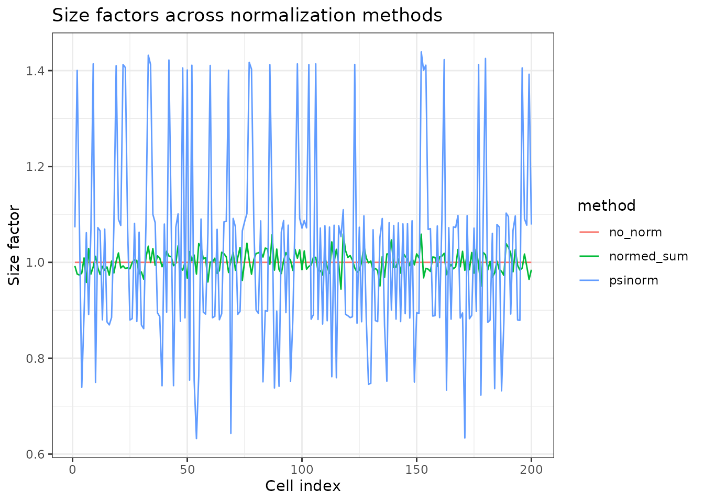
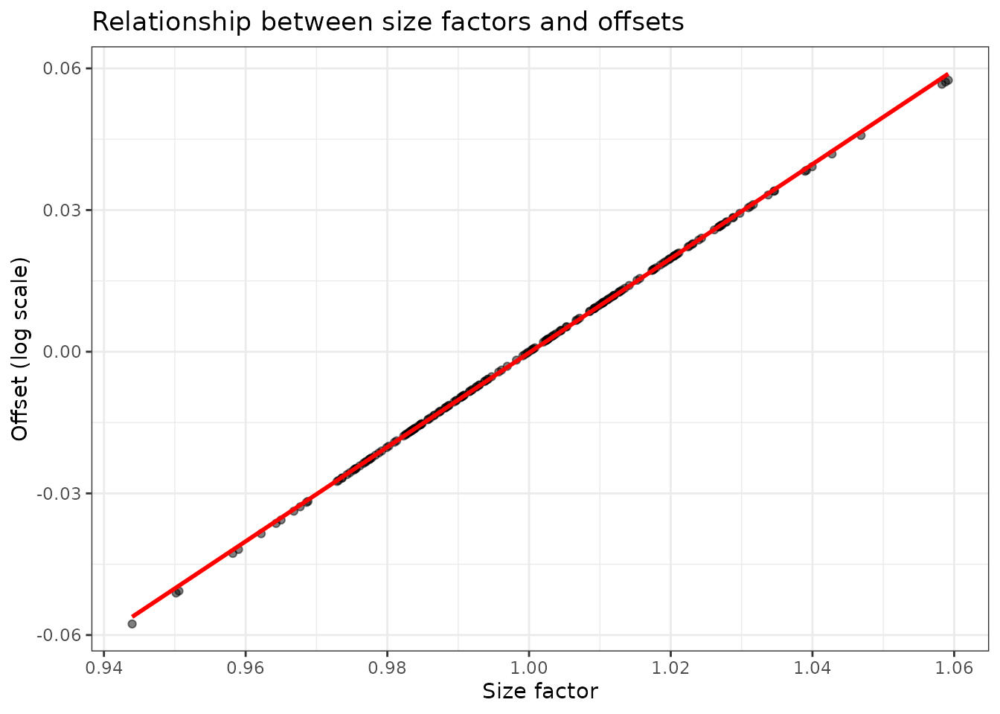
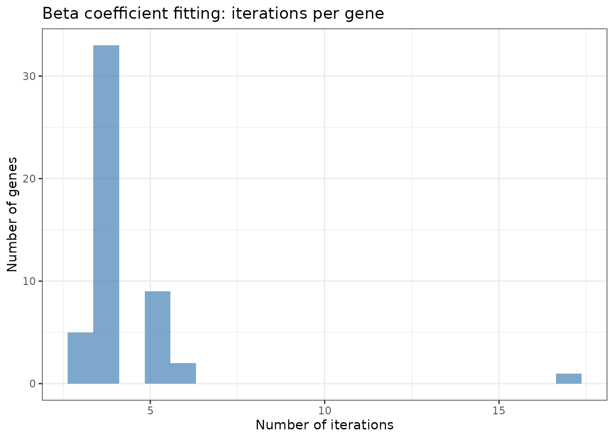
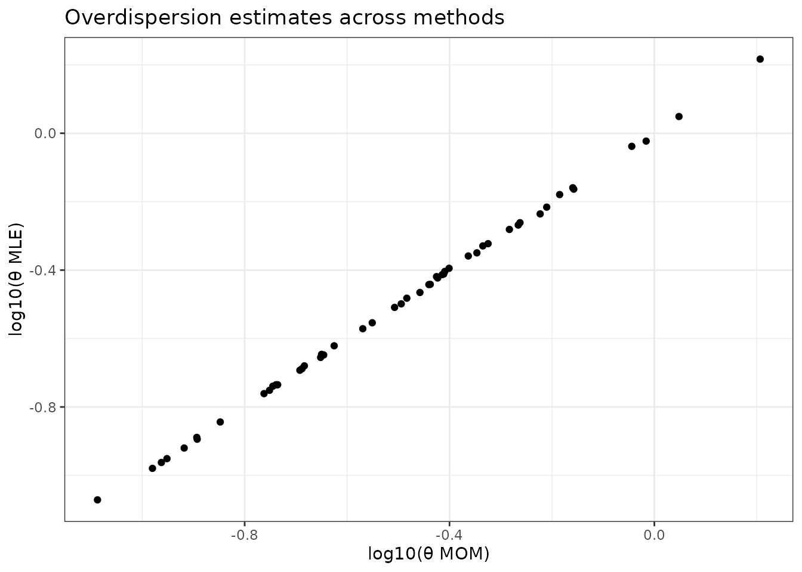

# devil model explained

``` r

library(devil)
library(ggplot2)
library(dplyr)
library(tidyr)
```

## Introduction

The **devil** package implements negative binomial regression for count
data, particularly designed for single-cell RNA-seq analysis. This
vignette explains:

1.  The statistical model and fitting procedure
2.  Shared computational steps (CPU and GPU)
3.  CPU implementation with practical examples
4.  GPU implementation (conceptual overview)
5.  When to use CPU vs GPU
6.  Performance optimization strategies

### The Statistical Model

Devil fits a **negative binomial generalized linear model** for each
gene:

``` math
Y_{ij} \sim \text{NB}(\mu_{ij}, \theta_i)
```

where:

- $`Y_{ij}`$ is the count for gene $`i`$ in cell $`j`$
- $`\mu_{ij} = s_j \exp(\mathbf{X}_j^T \boldsymbol{\beta}_i)`$ is the
  expected count
- $`s_j`$ is the size factor for cell $`j`$ (normalization)
- $`\mathbf{X}_j`$ is the design matrix row for cell $`j`$ (covariates)
- $`\boldsymbol{\beta}_i`$ is the coefficient vector for gene $`i`$
- $`\theta_i`$ is the overdispersion parameter for gene $`i`$

The model accounts for:

- **Technical variation** via size factors
- **Biological covariates** via the design matrix
- **Overdispersion** beyond Poisson variation

## Common Steps (CPU and GPU)

Both implementations share the following preprocessing steps:

### 1. Size Factor Calculation

Size factors normalize for differences in sequencing depth across cells.

``` r

# Simulate example data
set.seed(123)
n_genes <- 500
n_cells <- 200
counts <- matrix(
    rnbinom(n_genes * n_cells, mu = 20, size = 5),
    nrow = n_genes, ncol = n_cells
)
rownames(counts) <- paste0("Gene", seq_len(n_genes))
colnames(counts) <- paste0("Cell", seq_len(n_cells))

# Create design matrix (two groups)
group <- factor(rep(c("Control", "Treatment"), each = n_cells/2))
design <- model.matrix(~ group)
```

#### Available normalization methods:

``` r

# Method 1: Geometric mean normalization (default, fast)
fit_normed <- fit_devil(
    x = counts,
    design_matrix = design,
    clusters = NULL,
    size_factors = "normed_sum",
    verbose = FALSE
)

# Method 2: Psi-normalization (robust to highly variable genes)
fit_psi <- fit_devil(
    x = counts,
    design_matrix = design,
    clusters = NULL,
    size_factors = "psinorm",
    verbose = FALSE
)

# Method 3: No normalization (all size factors = 1)
fit_no_norm <- fit_devil(
    x = counts,
    design_matrix = design,
    clusters = NULL,
    size_factors = NULL,
    verbose = FALSE
)

# Compare size factors
sf_comparison <- data.frame(
    cell = seq_len(n_cells),
    normed_sum = fit_normed$size_factors,
    psinorm = fit_psi$size_factors,
    no_norm = fit_no_norm$size_factors
)

sf_comparison %>%
    pivot_longer(-cell, names_to = "method", values_to = "size_factor") %>%
    ggplot(aes(x = cell, y = size_factor, color = method)) +
    geom_line() +
    theme_bw() +
    labs(title = "Size factors across normalization methods",
         x = "Cell index", y = "Size factor")
```



**Interpretation**:

- `normed_sum`: Fast, works for most datasets
- `psinorm`: More robust when many genes are highly variable
- `NULL`: Use when data is already normalized

### 2. Offset Vector Computation

The offset vector incorporates size factors into the model:

``` r

# The offset is computed as: log(size_factor) + offset_constant
offset_constant <- 0  # default
offset_vector <- log(fit_normed$size_factors) + offset_constant

# Visualize the relationship
data.frame(
    size_factor = fit_normed$size_factors,
    offset = fit_normed$offset_vector
) %>%
    ggplot(aes(x = size_factor, y = offset)) +
    geom_point(alpha = 0.5) +
    geom_smooth(method = "lm", se = FALSE, color = "red") +
    theme_bw() +
    labs(title = "Relationship between size factors and offsets",
         x = "Size factor", y = "Offset (log scale)")
#> `geom_smooth()` using formula = 'y ~ x'
```



## CPU Implementation

The CPU implementation processes genes in parallel using multiple cores.

### Workflow Overview

    1. Initialize overdispersion parameters (θ)
       ├─ If init_overdispersion = NULL: estimate from data
       └─ Otherwise: use provided value
       
    2. Initialize beta coefficients (β)
       ├─ If init_beta_rough = TRUE: simple log-mean initialization
       └─ Otherwise: proper GLM initialization
       
    3. Fit beta coefficients (parallel across genes)
       
    4. Fit overdispersion parameters (parallel across genes)
       ├─ "MOM": Method of moments (fast, non-iterative)
       └─ "old"/"MLE": Maximum likelihood with Cox-Reid adjustment

### CPU Example with Detailed Timing

``` r

# Small dataset for demonstration
set.seed(456)

n_genes_small <- 50
n_cells_small <- 10000

# Gene-specific baseline expression (log-normal is realistic for RNA-seq)
gene_means <- rlnorm(
  n_genes_small,
  meanlog = log(15),
  sdlog   = 0.8
)

# Gene-specific overdispersion (theta)
gene_theta <- rlnorm(
  n_genes_small,
  meanlog = log(3),
  sdlog   = 0.7
)

counts_small <- matrix(
  0,
  nrow = n_genes_small,
  ncol = n_cells_small
)

for (g in seq_len(n_genes_small)) {
  counts_small[g, ] <- rnbinom(
    n_cells_small,
    mu   = gene_means[g],
    size = gene_theta[g]
  )
}

rownames(counts_small) <- paste0("Gene", seq_len(n_genes_small))
colnames(counts_small) <- paste0("Cell", seq_len(n_cells_small))

# Two-group design
design_small <- model.matrix(
  ~ factor(rep(c("Control", "Treatment"), each = n_cells_small / 2))
)

# CPU fit with different overdispersion strategies
system.time({
    fit_cpu_mom <- fit_devil(
        x = counts_small,
        design_matrix = design_small,
        clusters = NULL,
        size_factors = "normed_sum",
        overdispersion = "MOM",
        
        verbose = TRUE
    )
})
#> Compute size factors
#> Calculating size factors using method: normed_sum
#> Size factors calculated successfully.
#> Range: [0.6759, 1.6736]
#> ==> Initializing parameters
#> Initialize theta
#> Initialize beta
#> Fitting expression coefficients and overdispersion
#> Aggregating results
#>    user  system elapsed 
#>   0.175   0.295   0.160

system.time({
    fit_cpu_new <- fit_devil(
        x = counts_small,
        design_matrix = design_small,
        clusters = NULL,
        size_factors = "normed_sum",
        overdispersion = "MLE",
        
        verbose = TRUE
    )
})
#> Compute size factors
#> Calculating size factors using method: normed_sum
#> Size factors calculated successfully.
#> Range: [0.6759, 1.6736]
#> ==> Initializing parameters
#> Initialize theta
#> Initialize beta
#> Fitting expression coefficients and overdispersion
#> Aggregating results
#>    user  system elapsed 
#>   0.388   0.789   0.311
```

#### Examining Iteration Counts

``` r

# Beta fitting iterations (per gene)
beta_iter_summary <- data.frame(
    iterations = fit_cpu_new$iterations$beta_iters
)

ggplot(beta_iter_summary, aes(x = iterations)) +
    geom_histogram(bins = 20, fill = "steelblue", alpha = 0.7) +
    theme_bw() +
    labs(title = "Beta coefficient fitting: iterations per gene",
         x = "Number of iterations", y = "Number of genes")
```



### Overdispersion Estimation Strategies

The CPU implementation offers three strategies for estimating
overdispersion:

#### 1. Method of Moments (MOM) - Fastest

``` r

fit_mom <- fit_devil(
    x = counts_small,
    design_matrix = design_small,
    overdispersion = "MOM",
    verbose = FALSE
)

# MOM is non-iterative (0 iterations)
```

**When to use**:  
Large datasets or GPU-based workflows, when speed and scalability are
critical and a fully iterative dispersion fit is impractical.

**How it works**:  
In a regression setting, MOM does **not** rely on the raw sample mean
and variance of counts. Instead, it estimates overdispersion from the
**residual variability around the fitted mean** $`\mu_{ij}`$ implied by
the design matrix and offsets.

Concretely, after fitting (or updating) the regression coefficients
$`\boldsymbol{\beta}_i`$, devil computes fitted means $`\mu_{ij}`$ and
matches the negative binomial mean–variance relationship
``` math
\mathrm{Var}(Y_{ij}) = \mu_{ij} + \frac{\mu_{ij}^2}{\theta_i}
```
using squared residuals $`(y_{ij}-\mu_{ij})^2`$ to obtain a
**closed-form, non-iterative** estimate of $`\theta_i`$.

This makes MOM extremely fast and well suited for large-scale
single-cell analyses, while still accounting for the effects of
covariates and normalization through $`\mu_{ij}`$.

#### 2. MLE with Cox-Reid (MLE) - Most Accurate

``` r

fit_mle <- fit_devil(
    x = counts_small,
    design_matrix = design_small,
    overdispersion = "old",
    max_iter = 200,
    verbose = FALSE
)
```

**When to use**: Maximum precision, small datasets. **How it works**:
Maximum likelihood estimation with Cox-Reid adjustment.

#### Comparing Overdispersion Estimates

``` r

theta_comparison <- data.frame(
    gene = seq_len(n_genes_small),
    MOM = fit_mom$overdispersion,
    MLE = fit_mle$overdispersion
)

theta_comparison %>%
    #pivot_longer(-gene, names_to = "method", values_to = "theta") %>%
    ggplot(aes(x = log10(MOM), y = log10(MLE))) +
    geom_point() +
    theme_bw() +
    labs(title = "Overdispersion estimates across methods",
         x = "log10(θ MOM)", y = "log10(θ MLE)")
```



``` r


# Correlation between methods
cor(theta_comparison[, -1]) %>% round(3)
#>     MOM MLE
#> MOM   1   1
#> MLE   1   1
```

**Interpretation**: Methods generally agree, but MLE may provide more
stable estimates for difficult genes. MOM is fastest but may be less
precise for genes with extreme overdispersion.

### Beta Initialization Strategies

``` r

# Compare initialization strategies
time_rough <- system.time({
    fit_rough <- fit_devil(
        x = counts_small,
        design_matrix = design_small,
        init_beta_rough = TRUE,
        verbose = FALSE
    )
})

time_proper <- system.time({
    fit_proper <- fit_devil(
        x = counts_small,
        design_matrix = design_small,
        init_beta_rough = FALSE,
        verbose = FALSE
    )
})

print(paste("Rough init:", round(time_rough["elapsed"], 2), "sec"))
#> [1] "Rough init: 0.09 sec"
print(paste("Proper init:", round(time_proper["elapsed"], 2), "sec"))
#> [1] "Proper init: 0.14 sec"

# Check if results are similar
cor(fit_rough$beta[, 2], fit_proper$beta[, 2])
#> [1] 0.9999904
```

**Recommendation**: - `init_beta_rough = FALSE` (default): Proper GLM
initialization, more robust - `init_beta_rough = TRUE`: Faster for very
large datasets

The rough initialization simply uses `log(mean(y) + 1)` for the
intercept and zeros for other coefficients. The proper initialization
fits a simplified GLM to get better starting values.

## GPU Implementation (Conceptual)

The GPU implementation uses CUDA for massive parallelization across
genes.

### GPU Workflow

    1. Compute size factors and offsets (same as CPU)
       └─ This preprocessing happens on CPU

    2. Batch genes for memory efficiency
       ├─ Genes are divided into batches of size 'batch_size'
       └─ Default: 1024 genes per batch

    3. GPU kernel: Fit beta coefficients
       ├─ Each GPU thread handles one gene
       ├─ Thousands of genes fitted simultaneously
       └─ Iterative weighted least squares on GPU

    4. Overdispersion: Method of Moments only
       ├─ Computed on GPU (non-iterative)
       └─ Fast calculation across all genes

### Key Differences from CPU

| Feature | CPU | GPU |
|----|----|----|
| **Parallelization** | Across genes using CPU cores (typically 4-64) | Across genes using GPU threads (thousands) |
| **Memory model** | Distributed (per core) | Shared (batched on GPU memory) |
| **Overdispersion** | MOM, Iterative, or MLE | MOM only |
| **Beta initialization** | Full initialization available | Simplified initialization |
| **Batch processing** | All genes or chunked by core | Always batched for GPU memory |
| **Best for** | Small-medium datasets (\<5k genes) | Large datasets (\>10k genes, \>5k cells) |
| **Setup** | Works out of the box | Requires CUDA toolkit and recompilation |

### Session info

``` r

sessionInfo()
#> R version 4.6.1 (2026-06-24)
#> Platform: x86_64-pc-linux-gnu
#> Running under: Ubuntu 24.04.4 LTS
#> 
#> Matrix products: default
#> BLAS:   /usr/lib/x86_64-linux-gnu/openblas-pthread/libblas.so.3 
#> LAPACK: /usr/lib/x86_64-linux-gnu/openblas-pthread/libopenblasp-r0.3.26.so;  LAPACK version 3.12.0
#> 
#> locale:
#>  [1] LC_CTYPE=C.UTF-8       LC_NUMERIC=C           LC_TIME=C.UTF-8       
#>  [4] LC_COLLATE=C.UTF-8     LC_MONETARY=C.UTF-8    LC_MESSAGES=C.UTF-8   
#>  [7] LC_PAPER=C.UTF-8       LC_NAME=C              LC_ADDRESS=C          
#> [10] LC_TELEPHONE=C         LC_MEASUREMENT=C.UTF-8 LC_IDENTIFICATION=C   
#> 
#> time zone: UTC
#> tzcode source: system (glibc)
#> 
#> attached base packages:
#> [1] stats     graphics  grDevices utils     datasets  methods   base     
#> 
#> other attached packages:
#> [1] tidyr_1.3.2   dplyr_1.2.1   ggplot2_4.0.3 devil_0.99.0 
#> 
#> loaded via a namespace (and not attached):
#>  [1] SummarizedExperiment_1.42.0 gtable_0.3.6               
#>  [3] xfun_0.59                   bslib_0.11.0               
#>  [5] Biobase_2.72.0              lattice_0.22-9             
#>  [7] vctrs_0.7.3                 tools_4.6.1                
#>  [9] generics_0.1.4              stats4_4.6.1               
#> [11] parallel_4.6.1              tibble_3.3.1               
#> [13] pkgconfig_2.0.3             Matrix_1.7-5               
#> [15] RColorBrewer_1.1-3          S7_0.2.2                   
#> [17] desc_1.4.3                  S4Vectors_0.50.1           
#> [19] sparseMatrixStats_1.24.0    lifecycle_1.0.5            
#> [21] compiler_4.6.1              farver_2.1.2               
#> [23] textshaping_1.0.5           Seqinfo_1.2.0              
#> [25] codetools_0.2-20            htmltools_0.5.9            
#> [27] sass_0.4.10                 yaml_2.3.12                
#> [29] pkgdown_2.2.0               pillar_1.11.1              
#> [31] jquerylib_0.1.4             BiocParallel_1.46.0        
#> [33] DelayedArray_0.38.2         cachem_1.1.0               
#> [35] abind_1.4-8                 nlme_3.1-169               
#> [37] tidyselect_1.2.1            digest_0.6.39              
#> [39] purrr_1.2.2                 labeling_0.4.3             
#> [41] splines_4.6.1               fastmap_1.2.0              
#> [43] grid_4.6.1                  cli_3.6.6                  
#> [45] SparseArray_1.12.2          magrittr_2.0.5             
#> [47] S4Arrays_1.12.0             withr_3.0.3                
#> [49] DelayedMatrixStats_1.34.0   scales_1.4.0               
#> [51] rmarkdown_2.31              XVector_0.52.0             
#> [53] matrixStats_1.5.0           otel_0.2.0                 
#> [55] ragg_1.5.2                  evaluate_1.0.5             
#> [57] knitr_1.51                  GenomicRanges_1.64.0       
#> [59] IRanges_2.46.0              mgcv_1.9-4                 
#> [61] rlang_1.2.0                 Rcpp_1.1.1-1.1             
#> [63] glue_1.8.1                  BiocGenerics_0.58.1        
#> [65] jsonlite_2.0.0              R6_2.6.1                   
#> [67] MatrixGenerics_1.24.0       systemfonts_1.3.2          
#> [69] fs_2.1.0
```
